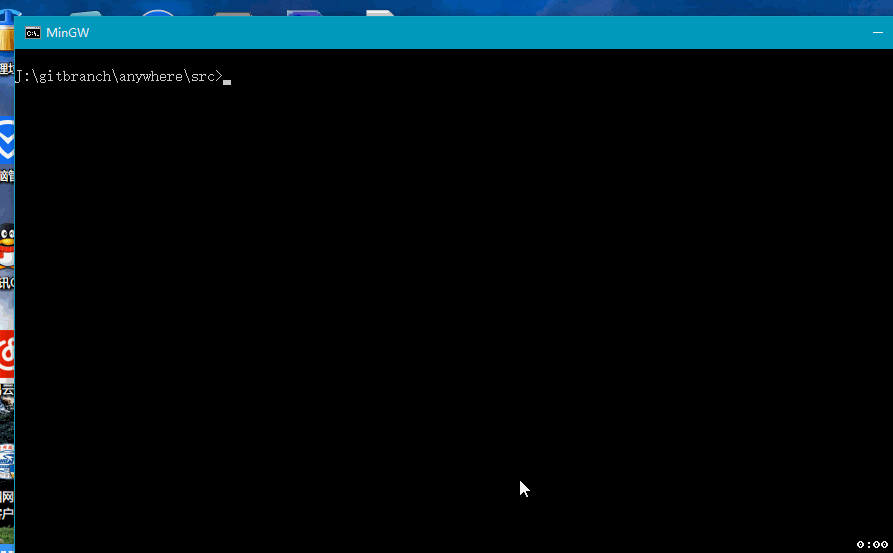
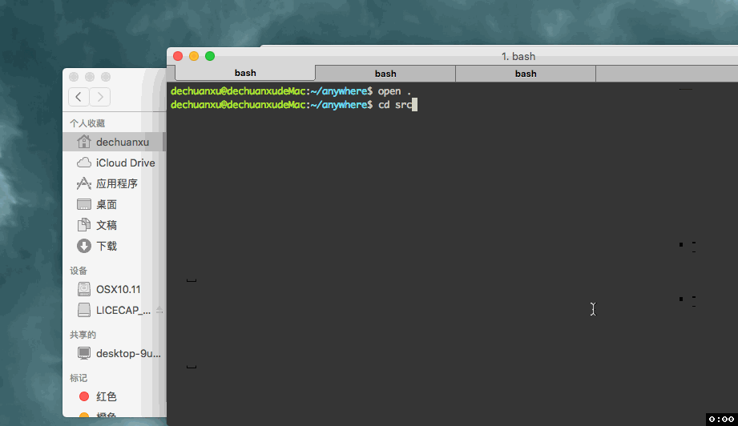

Anywhere 局域网文件传输服务
==============================

# 使用方法

1. 运行fileserv
2. 扫描显示二维码
3. 或者打开当前目录下的二维码图片扫描
4. 图片可能不止一个，无法访问则切换二维码尝试
## 编译使用
1. *Windows*:
2. *OSX*:


# WIFI使用
## 文件服务器最好的作用是在同一局域网(电脑开wifi共享给手机，共用一个路由器情况)下,手机无线浏览并下载电脑上的文件，支持多层目录访问
1. 在相应下载目录运行fileserv
2. windows运行`ipconfig /all`,Mac/Linux运行`ifconfig -a` 获取当前主机IP地址
3. 手机扫描生成的二维码访问服务器
4. 或者访问http://主机IP:端口号(IP由服务器显示给出,默认为8001)
5. 开始文件浏览下下载

# 测试结果
- 我的主机开wifi共享给手机，使用fileserv下载多个任务基本可以达到2M/s
- 不会出现像python服务器那样的中文乱码问题
- 不会出现python自带服务器半天无法下载和只能单个任务下载，后续任务长时间无响应等问题

# 版本变化

## v1.0 2016-02-28
1. 使用平台自带默认程序打开二维码
2. 遗弃Qt编译的显示图片部分，使得程序更加小巧和简单
3. win使用IE,Mac自带open打开,linux下使用gnome-open打开图片，需要安装

## 0.9 2016-02-28
1. 使用Qt编译了显示二维码部分，附带服务器信息，区别显著
2. 跨平台编译比较复杂，不够友好

## pre
- 生成二维码方便使用 

# Running static file server anywhere.。

## use

`fileserv -p [port]

1. direct use
```
go run fileserv.go [-p 8080]
```
2. build and run
```
go build src/fileserv.go
./fileserve [-p 8080]
```

3. execute
```
Windows 64 bit:     fileserv.exe
Mac/Linux 64 bit:  ./fileserv
```

## Visit

device in the same local network

- **Scan QR code after run the [fileserv]**

or input:
```
http://ip:8001        //default,ip just try follow the tips which server given.
http://ip:<your port> //self defined port
```
or phone visit(in a same LAN):
```
http://<your server ip>:<port>
```


